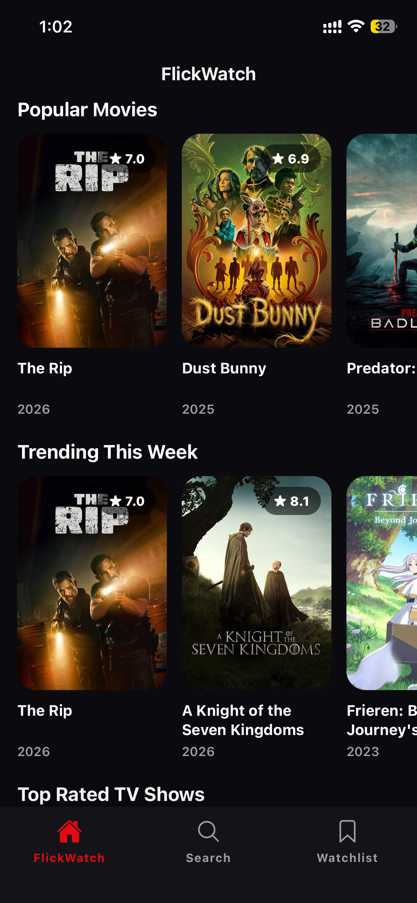
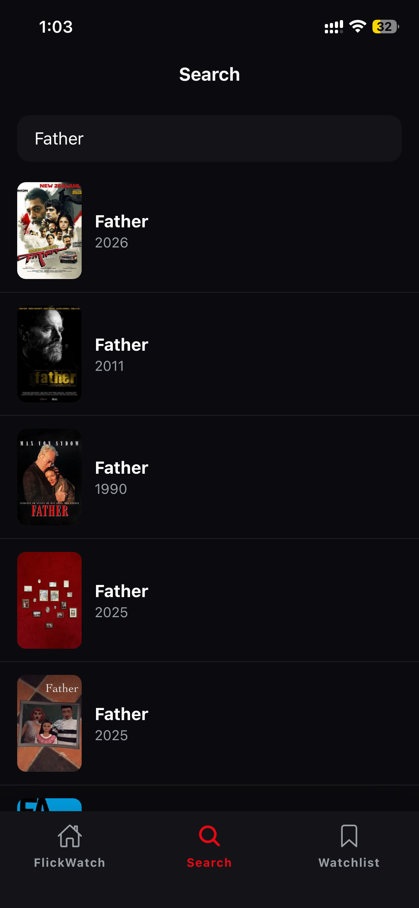
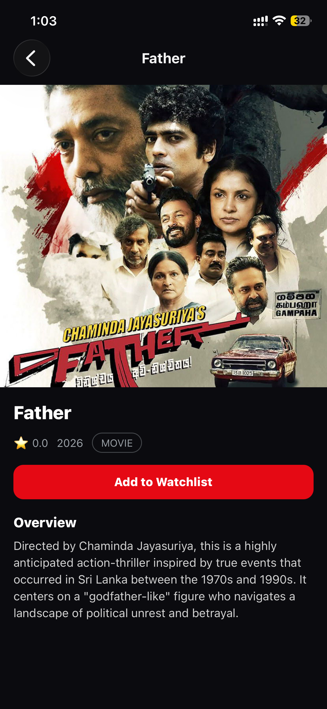
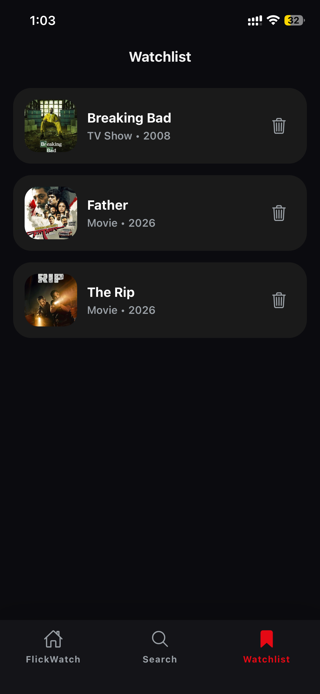

# 🎬 FlickWatch


FlickWatch is a modern **movie & TV discovery mobile app** built using **React Native (Expo)** and powered by the **TMDB API**.  
Users can browse popular content, explore trending movies and TV shows, search titles, and manage a personal watchlist — all in a clean **dark-themed UI**.

---

## ✨ Features

- 🔥 Browse **Popular Movies**
- 📈 Explore **Trending Movies & TV Shows**
- ⭐ View **Top Rated TV Shows**
- 🔍 Search movies & TV shows in real time
- ❤️ Add / remove items from a **Watchlist**
- 💾 Persistent watchlist using local storage
- 🌙 Fully **Dark Mode UI**
- 📱 Works on **Android & iOS**

---

## 🛠 Tech Stack

- **React Native (Expo)**
- **React Navigation** (Stack + Bottom Tabs)
- **Axios** (API requests)
- **TMDB API**
- **Context API** (Global state management)
- **AsyncStorage** (Persistent watchlist)
- **JavaScript (ES6+)**

---

## 🔑 Environment Variables

This project uses environment variables to keep API keys secure.

Create a `.env` file in the project root:

```env
EXPO_PUBLIC_TMDB_API_KEY=your_tmdb_api_key_here
```

⚠️ Important: The `.env` file is ignored by GitHub and should never be committed.

---

## 🚀 Getting Started

1️⃣ Clone the repository

```bash
git clone https://github.com/KasunHGamage/FlickWatch.git
cd FlickWatch
```

2️⃣ Install dependencies

```bash
npm install
```

3️⃣ Start the app

```bash
npx expo start
```

- Scan the QR code using Expo Go on your phone
- Or run on an Android emulator / iOS simulator

---

## 📸 Screenshots

### 🏠 Home Screen
<p align="left">
  
</p>

### 🔍 Search Screen
<p align="left">
  
</p>

### 🎬 Detail Screen
<p align="left">
  
</p>

### ❤️ Watchlist Screen
<p align="left">
  
</p>


## 🧠 Learning Outcomes

- API integration in React Native
- Building reusable UI components
- Global state management using Context API
- Navigation using Stack & Bottom Tabs
- Implementing a clean dark-mode UI
- Handling loading, error, and empty states

---

## 🎯 Future Improvements

- User authentication
- Cloud-synced watchlist
- Pagination & infinite scrolling
- Genre-based filtering
- Trailer playback support

---

## 👨‍💻 Author

Kasun Harsha  
🔗 GitHub: https://github.com/KasunHGamage

---

## 📄 License

This project is created for learning and portfolio purposes.
